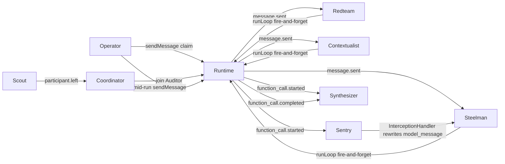

# Claimswarm

A [Mozaik Hackathon 2026](https://build.jigjoy.ai/) entry: a **concurrent** claim-investigation swarm, not a sequential agent pipeline.

**Submit-form paste:** [CONCURRENCY.md](./CONCURRENCY.md) is the written answer to “How do the agents run concurrently?” Official rules (updated 4 Sep 2026): https://build.jigjoy.ai/rules — submit at https://build.jigjoy.ai/submit

You state a claim. Steelman, Redteam, and Contextualist `join()` one runtime and start `runLoop` at the same time. Sentry reacts to `function_call.started` **while those loops are still running**. A policy `InterceptionHandler` aborts overconfident settlements mid-loop. Synthesizer updates a live board as `function_call.completed` arrives. The operator can inject a message mid-run. When Scout leaves, Auditor `join()`s — reassignment is a situation handler, not a controller.

Built from the official [`cli-agent-starter`](https://github.com/jigjoy-ai/cli-agent-starter) on **`@mozaik-ai/core` ^4.0.5** (current on npm; the older `^3.13` / `AgenticEnvironment` names are not what this package exports).

Organizers: JigJoy × daily.dev × Hyperskill. Docs: https://docs.jigjoy.ai/

## How the agents run concurrently

This section is what the submit form asks for. The paste-ready version is [CONCURRENCY.md](./CONCURRENCY.md).

Claimswarm is a Mozaik v4 swarm (`defineRuntime` + `join()` + fire-and-forget `runLoop`), not a sequential pipeline.

Three specialist agents — Steelman, Redteam, and Contextualist — each `join()` one runtime and keep their own `ModelContext`. When the operator `sendMessage`s a claim, every specialist’s `message.sent` handler calls `runLoop` and returns immediately. Mozaik does not await `runLoop` or `processor.apply`, so the three loops think, call `cite_evidence`, and answer at the same time. `npm run demo` prints ISO timestamps and exits 0 only if the third `inference.started` occurs before the first of those inferences completes.

They share the environment, not memory. Shared data lives on `ClaimswarmState` (claim, evidence board, sentry flags, roster) plus the event bus. Coordination is reaction:

- **Sentry** is a joined policy participant. On another agent’s `function_call.started` it flags the call while that caller is still inside its loop.
- Each specialist’s `runLoop` carries an **`InterceptionHandler`**. If a `model_message` tries to declare the claim “settled” / “proven beyond doubt”, the handler rewrites the transition to `message_received` mid-loop (`interception.started` / `interception.finished`) and that agent infers again. Other specialists are not paused.
- **Synthesizer** listens to `function_call.started`, `function_call.completed`, and `model.answer` and updates the live board as events arrive. It does not wait for a join barrier.
- The operator can `sendMessage` again mid-run; new loops start while earlier ones are still open.
- **Coordinator** watches `participant.left`. When Scout leaves, Auditor `join()`s the same runtime and starts investigating.

Nothing is one agent with tools in a for-loop. A join-and-wait fan-out cannot produce the overlap proof the demo requires.



Environment is shared (`ClaimswarmState` + the event bus). Each agent keeps its own `ModelContext`. Nothing is a single agent with tools in a for-loop.

## How to run

```bash
npm install
```

### 2–4 minute demo path (no API key)

```bash
npm test
npm run demo
```

`npm run demo` is the judge path. It uses `SimulatedInferenceRunner` so `runLoop` still runs — it just does not call OpenAI. Watch for:

1. Three `inference.started` lines whose timestamps overlap.
2. `function_call.started` then `sentry.reacted` before that caller’s loop goes idle.
3. `board.updated` on `function_call.completed` (Synthesizer, not a final join).
4. `interception.started` when Steelman’s overconfident settlement is rewritten.
5. A mid-run operator inject, then Scout leaving and Auditor joining.

The process exits `0` only if overlap + sentry + interceptor are proven.

### Interactive ops room

```bash
npm start -- --sim
```

Type a claim, press Enter, then type another line while the board is moving. `/leave` drops Scout (Auditor joins). `/exit` quits.

### Live OpenAI

```bash
cp .env.example .env   # set OPENAI_API_KEY
npm start -- --live
```

Same participants, same interceptor, same tools. The model is `gpt-5.4-mini`. Without a key, the TUI falls back to dry-run.

## Architecture

| Participant | Role | What it reacts to |
|---|---|---|
| Operator | Human | Sends the claim and mid-run injects |
| Steelman / Redteam / Contextualist | Agents | `message.sent` from others → `runLoop` + `InterceptionHandler` |
| Sentry | Policy observer | `function_call.started`, `interception.*` |
| Synthesizer | Live board | `function_call.started/completed`, `model.answer` |
| Coordinator | Roster | `participant.joined` / `participant.left` → Auditor `join()` |
| EventLog | Transcript | Loop events with ISO timestamps |
| Scout / Auditor | Reassignment | Scout leaves; Auditor joins mid-run and starts investigating |

Tools (`cite_evidence`, `publish_verdict`) search a **local** public-finding corpus (Bloom/Ctrip 2015, Gibbs et al., Microsoft Work Trend Index, Barrero/Bloom/Davis). No search API. No invented papers.

## Tests

`npm test` drives the real runtime:

- participants `join()` and keep separate contexts
- a simulated `function_call.started` makes Sentry (and Synthesizer) react immediately
- `function_call.completed` updates the board
- `InterceptionHandler` rewrites an overconfident `model_message`
- three `runLoop`s overlap in time; Scout leave assigns Auditor

## Contest notes

Official rules (last updated 4 September 2026): https://build.jigjoy.ai/rules

- **Must use `@mozaik-ai/core`.** This repo depends on `^4.0.5` and builds with `defineRuntime`, `createAgent` / `createHuman`, `runLoop`, `InterceptionHandler`, and structured `ContextItem`s. Current docs: https://docs.jigjoy.ai/
- **Two or more concurrent agents.** Three specialists run overlapping `runLoop`s; Sentry is a fourth live participant. A single-agent project does not qualify.
- **README concurrency write-up.** See the section above and [CONCURRENCY.md](./CONCURRENCY.md) for the submit-form paste.
- Deadline Monday 7 September 2026 09:00 CET. Resubmits allowed; latest entry is judged.
- Starter/boilerplate allowed; this entry is the swarm substance (not the one-agent Ink template). AI-assisted development is allowed.
- Solo entry. Teams may be up to 4; this is one person.
- Judging weight: genuine concurrency, execution, creativity, demo clarity. `npm run demo` is the 2–4 minute path; a screen recording of it is the intended demo video.
- Cash prizes are paid through Upwork per the official rules. No payment details are stored here.
- MIT license. No secrets in the repo. `OPENAI_API_KEY` is optional and read from the environment.
- Dry-run is not a fake test: it still constructs a Mozaik runtime, joins participants, and runs `runLoop`.
